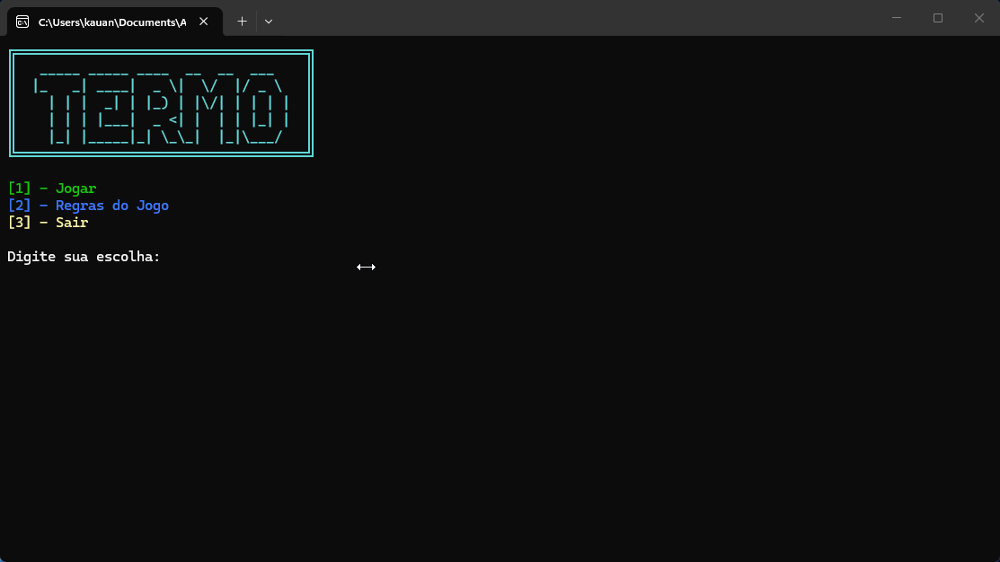

# Termo (Console)

Termo e um jogo iniciamente de navegador (https://term.ooo), no Termo nos temos que adivinhar uma palavra com cinco caracteres e cinco chances onde e resetada todo o dia sendo aleatória, nesse projeto utilizamos um dicionário contendo as palavras aleatórias com cinco caracteres, onde é resetada toda a vez que o usuário retorna a o programa. Projeto feito em C# na Academia-Do-Programador Full-Stack

# Funcionalidades

- Menu interativo com arte ASCII, com Jogar, Regras e Sair
- Dicionário para gerar palavras completamente aleatórias
- Para a cada erro a letra errada ficará vermelha 🟥​
- Para a cada acerto a letra acertada na posição correta ficará verde🟩​
- Para a cada acerto na posisão errada a letra ficará 🟨​

## Como jogar?

1. Clone o repositório ou baixe o código comprimido em .zip.
2. Abra o emulador de terminal e navegue até a pasta raiz.
3. Utilize o comando abaixo para restaurar as dependências do projeto.

   ```
   dotnet restore
   ```

4. Em seguida compile e execute o projeto com o comando:

   ```
   dotnet run --project Termo.ConsoleApp1
   ```

## Requisitos

- .NET SDK 10.0+


